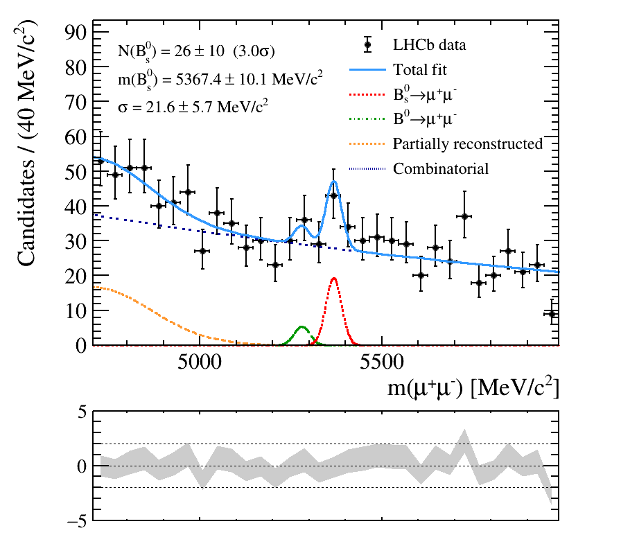

# Search for the rare decay $B_s^0 \to \mu^+\mu^-$

A cut-based search for the very rare decay $B_s^0 \to \mu^+\mu^-$ using LHCb
open data. The analysis selects dimuon candidates, applies a cut-based
selection and extracts the $B_s^0$ peak with an unbinned maximum-likelihood
mass fit.

See [docs/analysis.md](docs/analysis.md) for the analysis details.

## Setup

With conda / micromamba:

```bash
conda env create -f environment.yml
conda activate bs2mumu
```

or with pip:

```bash
python -m venv venv && source venv/bin/activate
pip install -r requirements.txt
```

## Run

```bash
snakemake --cores 16
```

This runs the full pipeline:

1. `src/selection.py` — applies the selection to the input samples listed in
   `config.yaml` and writes `results/selected_data.root`;
2. `src/mass_fit.py` — fits the dimuon mass spectrum and writes
   `figures/mass_fit.png`.

The `notebooks/` folder contains standalone example notebooks (not part of
the pipeline); to run them locally install `jupyter` in addition to the
requirements above.

Input files are taken from the local paths in `config.yaml` when present,
otherwise they are read from the remote (xrootd) URLs — no manual download
is required.
To add more data, append new entries to `config.yaml` and rerun `snakemake`.

## Result

Running the pipeline reproduces the fit of the dimuon invariant-mass
spectrum ($B_s^0$ and $B^0$ signal peaks, partially reconstructed and
combinatorial backgrounds — see [docs/analysis.md](docs/analysis.md)):


